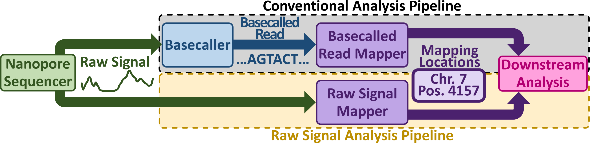
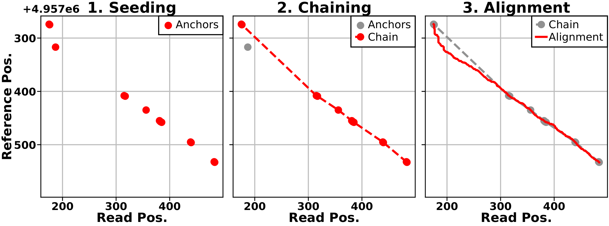
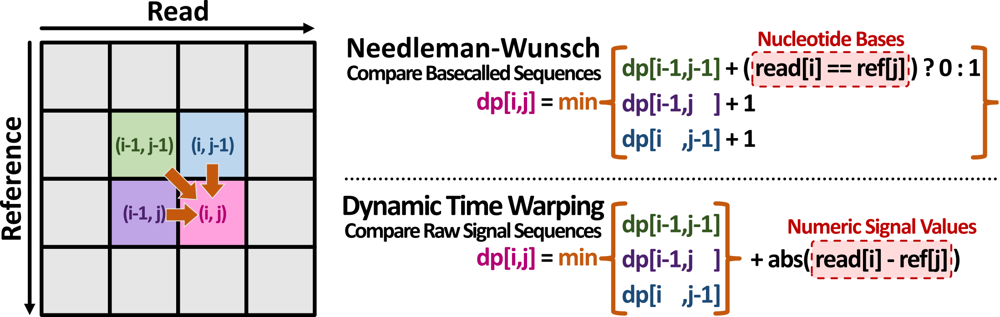

# RawAlign

RawAlign is a real-time raw nanopore read mapper based on the Seed-Filter-Align paradigm. Contrary to conventional basecalled read mappers (below figure, top), RawAlign directly maps raw nanopore reads to a reference database (e.g., a human reference genome, or a combination of genomes for metagenomic analyses) without the need for basecalling the reads (below figure, bottom).

<p align="center" width="100%">
    
</p>

RawAlign follows the Seed-Filter-Align or Seed-Filter-Extend paradigm, inspired by conventional basecalled read mappers such as [minimap2](https://github.com/lh3/minimap2). The main mapping process consists of three steps: seeding, filtering, and alignment. The below figure shows a real example of each of these steps in RawAlign for a single read.

<p align="center" width="100%">
    
</p>

RawAlign uses the seeding and filtering methods from the prior work [RawHash](https://github.com/CMU-SAFARI/RawHash/). During alignment or extension, RawAlign evaluates each candidate region resulting from chaining at fine granularity using dynamic time warping (DTW). As shown in the below figure, DTW is conceptually similar to Needleman-Wunsch and Smith-Waterman, which are commonly used for basecalled read mapping. However, DTW is more suitable for raw signal mapping because it is more tolerant to the types of noise expected in a raw nanopore signal.

<p align="center" width="100%">
    
</p>

RawAlign accepts a set of raw signal read files in a variety of formats and a reference database (e.g., a human reference genome, or a combination of genomes for metagenomic analyses) in FASTA format, and generates mappings as a PAF file. Optionally, RawAlign's output PAF file includes a precise event-to-base alignment path (analogous to the CIGAR string for basecalled read mapping).

# Installation

* Clone the code from its GitHub repository (`--recursive` must be used):

```bash
git clone --recursive https://github.com/CMU-SAFARI/RawAlign.git
cd RawAlign
```

## Installing RawAlign (Automated, for Reproducing Results)

To run and evaluate RawAlign, a number of dependencies and baselines are required. The following command automatically sets up everything that is required:

```bash
source ensure_full_environment.sh
```
This command installs missing dependencies, if any, compiles RawAlign, and sets up environment variables. Hence, it is important to run the file with `source` instead of `bash` or `sh`.
The command should be re-run if the environment variables are lost (e.g., when a new terminal is opened).

## Installing RawAlign (Minimal, for Running RawAlign)

### ONT Vbz HDF5 Plugin
It is possible that your reads in fast5 files are compressed with the [VBZ compression](https://github.com/nanoporetech/vbz_compression) from Nanopore. Then you have to download the proper HDF5 plugin from [here](https://github.com/nanoporetech/vbz_compression/releases) and make sure it can be found by your HDF5 library:
```bash
export HDF5_PLUGIN_PATH=/path/to/hdf5/plugins/lib
```

If you have conda you can simply install the following package (`ont_vbz_hdf_plugin`) in your environment and use RawAlign while the environment is active:

```bash
conda install ont_vbz_hdf_plugin
```

### Compile RawAlign

Make sure you have a C++ compiler and GNU make.

```bash
make
```

If the compilation is successful, the binary will be in `bin/rawalign`.


# Usage

You can print the help message to learn how to use RawAlign:
```bash
rawalign
```

In particular, there are **two key CLI flags** for RawAlign:
```
--dtw-evaluate-chains       | enable mapping based on RawAlign's alignment score, instead of based on RawHash's chaining score. This setting should almost always be enabled, otherwise RawAlign behaves largely like RawHash (default: no)
--dtw-output-cigar          | output the CIGAR-like event-to-base alignment path as a tag in the PAF file (default: no)
```

RawAlign's mapping and alignment is controllable by the following optional parameters, all of which have reasonable default values. It is not necessary to change these parameters for most use cases.
```
--dtw-border-constraint STR | DTW border constraint: 'global', 'sparse' (i.e., align only between anchors) default: sparse
--dtw-fill-method STR       | 'full', 'banded', or 'banded=[band_radius_frac]'. For example, for a 15% band radius (equivalent to a 30% band width), use 'banded=0.15' (default: banded=0.1)
--dtw-match-bonus FLOAT     | DTW bonus score per aligned read event (default: 0.4)
--dtw-min-score FLOAT       | DTW minimum alignment score for a candidate to be considered mapped (default: 20.0)
```

## Indexing
Indexing is similar to minimap2's usage. We additionally include the pore models located under ./extern

Below is an example that generates an index file `ref.ind` for the reference genome `ref.fasta` using a certain k-mer model located under `extern` and `32` threads.

```bash
rawalign -d ref.ind -p extern/kmer_models/r9.4_180mv_450bps_6mer/template_median68pA.model -t 32 ref.fasta
```

Note that you can optionally directly jump to mapping without creating the index because RawAlign is able to generate the index relatively quickly on-the-fly within the mapping step. However, a real-time genome analysis application may still prefer generating the indexing before the mapping step. Thus, we suggest creating the index before the mapping step.

## Mapping

It is possible to provide inputs as FAST5 files from multiple directories. It is also possible to provide a list of files matching a certain pattern such as `test/data/contamination/fast5_files/Min*.fast5`

* Example usage where multiple files matching a certain the pattern `test/data/contamination/fast5_files/Min*.fast5` and fast5 files inside the `test/data/d1_sars-cov-2_r94/fast5_files` directory are inputted to RawAlign using `32` threads and the previously generated `ref.ind` index:

```bash
rawalign --dtw-evaluate-chains -t 32 ref.ind test/data/contamination/fast5_files/Min*.fast5 test/data/d1_sars-cov-2_r94/fast5_files > mapping.paf
```

* Another example usage where 1) we only input a directory including FAST5 files as set of raw signals and 2) the output is directly saved in a file.

```bash
rawalign --dtw-evaluate-chains -t 32 -o mapping.paf ref.ind test/data/d1_sars-cov-2_r94/fast5_files
```

**IMPORTANT** if there are many fast5 files that RawAlign needs to process (e.g., thousands of them), we suggest that you specify **only** the directories that contain these fast5 files

RawAlign also provides a set of default parameters that can be preset automatically.

* Mapping reads to a viral reference genome using its corresponding preset:

```
rawalign --dtw-evaluate-chains -t 32 -x viral ref.ind test/data/d1_sars-cov-2_r94/fast5_files > mapping.paf
```

* Mapping reads to small reference genomes (<50M bases) using its corresponding preset:

```
rawalign --dtw-evaluate-chains -t 32 -x sensitive ref.ind test/data/d1_sars-cov-2_r94/fast5_files > mapping.paf
```

* Mapping reads to large reference genomes (>50M bases) using its corresponding preset:

```
rawalign --dtw-evaluate-chains -t 32 -x fast ref.ind test/data/d1_sars-cov-2_r94/fast5_files > mapping.paf
```

* Although we have not thoroguhly evaluated, RawAlign also provides another set of default parameters that can be used for very large metagenomic samples (>10G). To achieve efficient search, it uses the minimizer seeding in this parameter setting. This setting is not evaluated in our manuscript.

```
rawalign --dtw-evaluate-chains -t 32 -x faster ref.ind test/data/d1_sars-cov-2_r94/fast5_files > mapping.paf
```

The output will be saved to `mapping.paf` in a modified PAF format used by [Uncalled](https://github.com/skovaka/UNCALLED).


# Reproducing the results

Please follow the instructions in the [README](test/README.md) file in [test](./test/).

# Citing RawAlign

To cite RawAlign, please cite the following works:

```bibtex
@article{lindegger_rawalign_2023,
	title = {{RawAlign}: Accurate, Fast, and Scalable Raw Nanopore Signal Mapping via Combining Seeding and Alignment},
	author = {Lindegger, Joel and Firtina, Can and Mansouri Ghiasi, Nika and Sadrosadati, Mohammad and Alser, Mohammed and Mutlu, Onur},
	journal = {arXiv},
	month = oct,
	year = {2023}
}
@article{firtina_rawhash_2023,
	title = {{RawHash}: Enabling Fast and Accurate Real-Time Analysis of Raw Nanopore Signals for Large Genomes},
	author = {Firtina, Can and Mansouri Ghiasi, Nika and Lindegger, Joel and Singh, Gagandeep and Cavlak, Meryem Banu and Mao, Haiyu and Mutlu, Onur},
	journal = {Bioinformatics},
	volume = {39},
	number = {Supplement_1},
	pages = {i297-i307},
	month = jun,
	year = {2023},
	doi = {10.1093/bioinformatics/btad272},
	issn = {1367-4811},
	url = {https://doi.org/10.1093/bioinformatics/btad272},
}
```
